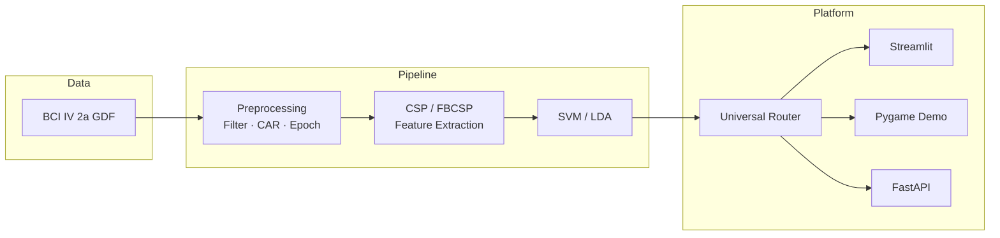

# Motor Imagery BCI Platform

[](https://www.python.org/)
[](https://www.bbci.de/competition/iv/)
[](LICENSE)

End-to-end **motor imagery (MI) brain–computer interface** pipeline and interactive demo platform built on the [BCI Competition IV Dataset 2a](https://www.bbci.de/competition/iv/#dataset2a). The project covers signal preprocessing, leakage-safe cross-validation, systematic hyperparameter search, subject-specific model optimization, cross-subject analysis, and real-time inference with **Streamlit**, **Pygame**, and **FastAPI**.

> **Resume one-liner:** Designed and implemented a full-stack MI-BCI system achieving **72.7% mean 5-fold CV accuracy** (9 subjects, 4-class) via FBCSP/CSP pipelines, with an interactive demo platform supporting GDF replay, universal subject routing, and rigorous experiment reproducibility.

---

## Highlights

| Area | Achievement |
|------|-------------|
| **Classification** | Per-subject optimized pipeline: **72.7%** mean CV (vs. 65.6% default CSP+SVM) |
| **Experiment design** | **432-config** grid search (band × window × CAR × method), leakage-safe 5-fold CV |
| **Deep learning baseline** | EEGNet comparison: **52.4%** mean (traditional methods win on this dataset) |
| **Cross-subject study** | Transfer learning & LOSO analysis (~39% true cross-subject ceiling) |
| **Diagnostics** | ERD/ERS + t-SNE confirmed BCI illiteracy in subjects A04/A06 (~50% ceiling) |
| **Demo platform** | Pygame ball game, Streamlit UI, FastAPI, Universal Smart Router (A01–A09 + external A010) |

---

## Demo

### Streamlit Web UI

```bash
pip install -r requirements.txt
streamlit run app.py
# → http://localhost:8501
```

Select **UNIVERSAL** model, choose or upload a `.gdf` file, run prediction.

### Pygame Interactive Game

```bash
python demo/run_demo.py
```

Space = next trial · Left/Right MI moves the ball · Browse GDF from menu.

### Batch Replay & API

```bash
python demo/run_demo.py --replay --subject A09
python demo/run_demo.py --api --subject A09   # http://127.0.0.1:8765/health
```

---

## Results

### Per-subject best configuration (5-fold CV)

| Subject | Method | Config | CV Accuracy |
|---------|--------|--------|-------------|
| A01 | FBCSP+LDA | 4–40 Hz, 0.5–4.0 s | **82.3%** |
| A02 | FBCSP+LDA | 7–35 Hz, 1.0–4.0 s | 68.8% |
| A03 | CSP+SVM | 8–30 Hz, 0.5–3.5 s | **86.8%** |
| A04 | FBCSP+LDA | 8–30 Hz, 0.5–2.5 s | 50.3% † |
| A05 | FBCSP+LDA | 4–40 Hz, 0.5–4.0 s + CAR | 75.0% |
| A06 | FBCSP+LDA | 4–40 Hz, 0.5–4.0 s | 49.0% † |
| A07 | FBCSP+LDA | 8–30 Hz, 0.5–4.0 s | 79.5% |
| A08 | CSP+SVM | 4–40 Hz, 0.5–3.5 s + CAR | **86.8%** |
| A09 | CSP+SVM | 7–35 Hz, 0.5–2.5 s + CAR | 76.0% |
| **Mean** | | | **72.7%** |

† A04/A06: BCI illiteracy (weak ERD/ERS); confirmed via signal diagnostics, not fixable by tuning alone.

### Method comparison (mean CV)

| Method | Mean Accuracy |
|--------|---------------|
| Default CSP + SVM | 65.6% |
| Default FBCSP + LDA | 61.0% |
| **Per-subject optimized** | **72.7%** |
| EEGNet (deep baseline) | 52.4% |
| Cross-subject LOSO (single model) | ~39% |

Full experiment outputs: [`outputs/experiments/`](outputs/experiments/)

---

## Architecture



```
Motor-Imagery-BCI-Platform/
├── app.py                          # Streamlit inference UI
├── train.py                        # Training entry (CSV / GDF / --optimized)
├── config.py                       # Paths, event codes, label mapping
├── src/
│   ├── gdf_preprocessing.py        # MNE GDF loading, 4-class & LR 2-class
│   ├── gdf_trainer.py              # CSP+SVM / FBCSP+LDA training
│   ├── fbcsp.py                    # Filter Bank CSP + LDA
│   ├── eegnet.py                   # EEGNet (PyTorch, sklearn API)
│   ├── experiment_eval.py          # Leakage-safe 5-fold CV
│   ├── universal_model.py          # Universal Smart Router bundle
│   └── transfer_learning.py        # Cross-subject transfer experiments
├── bci_platform/                   # Demo inference platform
│   ├── inference_engine.py
│   ├── feature_pipeline.py
│   ├── game/ball_game.py           # Pygame interactive demo
│   └── api/server.py               # FastAPI REST service
├── demo/run_demo.py                # One-click demo launcher
├── models/                         # Trained .pkl models + manifest.json
├── outputs/experiments/            # CSV reports, confusion matrices, plots
└── run_*.py                        # Experiment runners (grid, EEGNet, transfer, …)
```

---

## Quick Start

### 1. Clone & install

```bash
git clone https://github.com/getupgogogo999/Motor-Imagery-BCI-Platform.git
cd Motor-Imagery-BCI-Platform
pip install -r requirements.txt
```

### 2. Download data

Raw GDF files are **not** included (license + size). Download and extract:

| Dataset | URL | Place in |
|---------|-----|----------|
| BCI IV 2a (required) | [BCICIV_2a_gdf.zip](https://www.bbci.de/competition/download/competition_iv/BCICIV_2a_gdf.zip) | `BCICIV_2a_gdf/` |
| BCI IV 2b (optional, A010) | [BCICIV_2b_gdf.zip](https://www.bbci.de/competition/download/competition_iv/BCICIV_2b_gdf.zip) | `BCICIV_2b_gdf/` |

Expected 2a files: `A01T.gdf` … `A09T.gdf`.

### 3. Train models (or use bundled `.pkl`)

```bash
# Per-subject optimized models (recommended)
python train.py --source gdf --optimized

# Build Universal Smart Router (auto-routes A01–A09 by filename)
python run_build_universal_model.py
```

### 4. Run demo

```bash
streamlit run app.py
python demo/run_demo.py
```

---

## Experiments & Reproducibility

| Script | Purpose |
|--------|---------|
| `run_experiments_fast.py` | 432-config grid search (resumable) |
| `generate_experiment_report.py` | Aggregate results → CSV |
| `generate_best_confusion_matrices.py` | Per-subject confusion matrices |
| `run_eegnet_comparison.py` | EEGNet vs CSP/FBCSP benchmark |
| `run_transfer_learning.py` | Cross-subject transfer (A04/A06) |
| `run_mi_signal_analysis.py` | ERD/ERS + t-SNE diagnostics |
| `run_prepare_a010_external.py` | External subject A010 from BCI 2b |
| `benchmark_ceiling.py` | Theoretical / empirical accuracy ceiling |

All evaluations use **Stratified 5-fold CV** with CSP/scaler fitted **inside each fold only** (see `outputs/experiments/leakage_audit.txt`).

---

## Universal Smart Router

A single `motor_imagery_universal.pkl` bundles per-subject best models and **auto-selects** the correct pipeline from the GDF filename (e.g. `A05T.gdf` → A05 FBCSP+LDA).

- **Not** a single shared-weight model across subjects (LOSO ~39%).
- **Is** a production-friendly router for matched-subject inference at each subject's CV ceiling.
- Optional **A010** sub-model: left/right MI from BCI IV 2b (3-channel, binary).

---

## Control Mapping

| Motor Imagery | UI Label | Demo Command |
|---------------|----------|--------------|
| Left hand | Left Hand | Move Left |
| Right hand | Right Hand | Move Right |
| Feet | Feet | Move Forward |
| Tongue | Tongue | Select |

Event codes (BCI 2a): 769 / 770 / 771 / 772.

---

## Tech Stack

- **Signal processing:** MNE-Python, SciPy (Butterworth filter, CAR)
- **ML:** scikit-learn (CSP, SVM, LDA), PyTorch (EEGNet), XGBoost / LightGBM (experiments)
- **Riemannian:** pyriemann (transfer learning)
- **UI:** Streamlit, Pygame, FastAPI + Uvicorn
- **Viz:** Matplotlib, Seaborn

---

## Resume Bullet Points (copy-paste)

**中文：**

- 基于 BCI Competition IV 2a 数据集，独立实现从 EEG 预处理、CSP/FBCSP 特征提取到分类的完整 MI-BCI 流水线，通过 432 组网格搜索与受试者级调参，将 9 人平均 5 折 CV 准确率从 65.6% 提升至 **72.7%**。
- 设计并实现可部署的 BCI Demo 平台（Streamlit / Pygame / FastAPI），支持 GDF 试次回放、Universal 受试者路由、推理日志与模型热加载。
- 完成 EEGNet 深度基线、跨受试者迁移学习、ERD/ERS 信号诊断等对比实验，确认 BCI 失读受试者上限并排除数据泄漏。

**English:**

- Built an end-to-end motor imagery BCI pipeline on BCI Competition IV 2a, raising mean 5-fold CV accuracy from 65.6% to **72.7%** via 432-config grid search and per-subject FBCSP/CSP optimization.
- Delivered a deployable demo platform (Streamlit, Pygame, FastAPI) with GDF replay, universal subject routing, and hot-loaded inference.
- Conducted rigorous benchmarks (EEGNet, cross-subject transfer, ERD/ERS diagnostics) with leakage-safe CV and documented BCI illiteracy limits.

---

## Citation

If you use the BCI Competition data, please cite the corresponding competition paper and dataset description:

> Tangermann, M., et al. (2012). Review of the BCI Competition IV. *Dataset 2a*: Leeb et al., Graz BCI lab.

---

## License

MIT License — see [LICENSE](LICENSE).  
BCI Competition datasets are subject to their [original terms of use](https://www.bbci.de/competition/iv/).

---

## Author

**GitHub:** [@getupgogogo999](https://github.com/getupgogogo999)  
**Repository:** [Motor-Imagery-BCI-Platform](https://github.com/getupgogogo999/Motor-Imagery-BCI-Platform)
